

 
# 🍏 About ScholarUp

ScholarUp is a **study companion** designed with students in mind. Born from the frustration of juggling multiple apps for studying, planning, and staying motivated, ScholarUp brings everything together in one beautifully cohesive experience.

--- 

## 📗 Authentication 
 

    
    

 ##  Flashcards
 ### Creating sets & cards

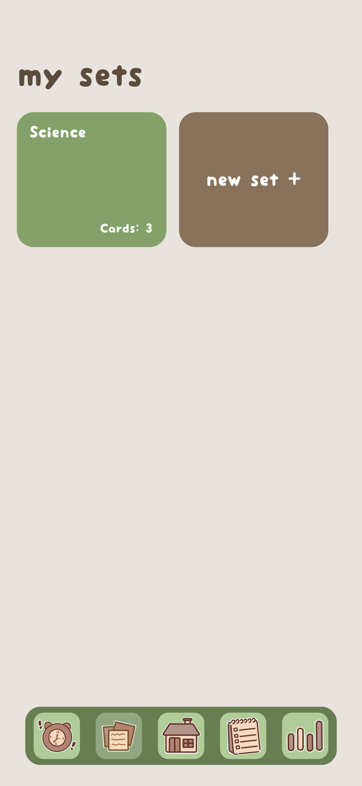
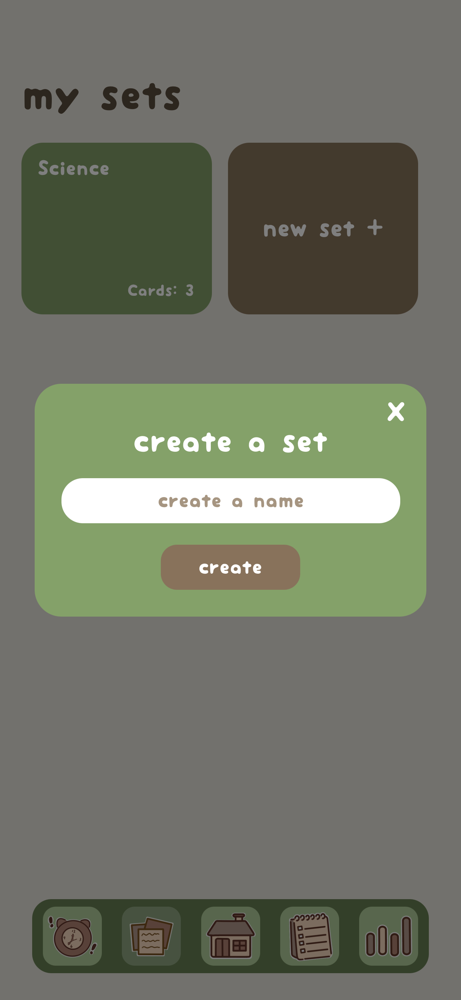
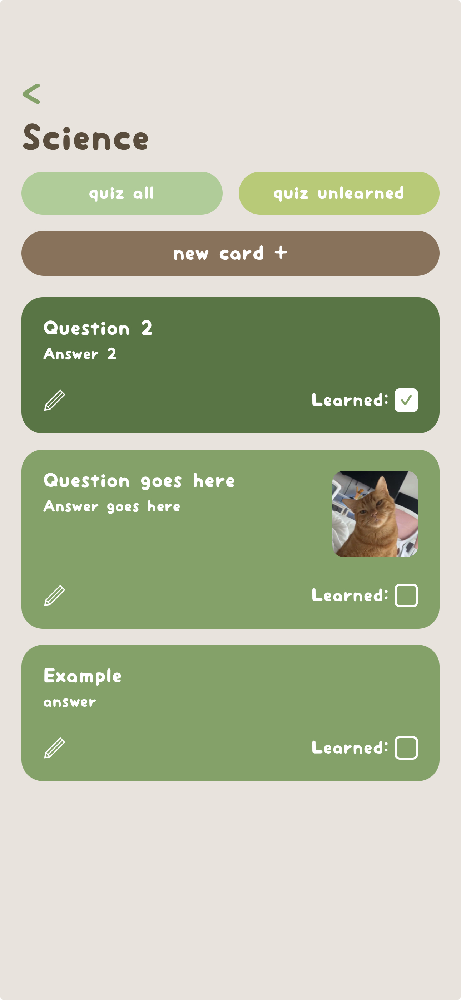
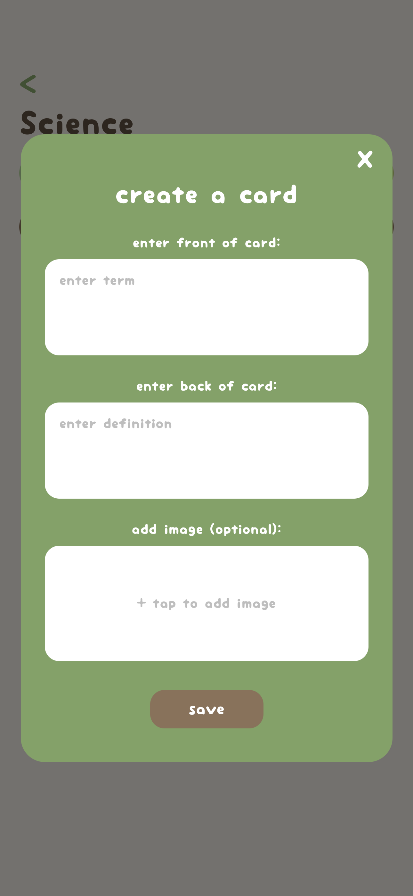

### Taking a quiz

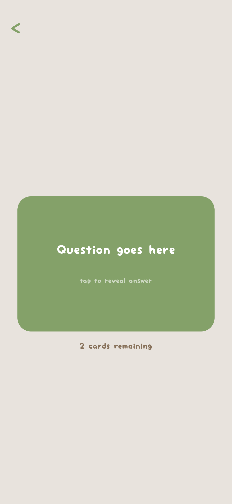
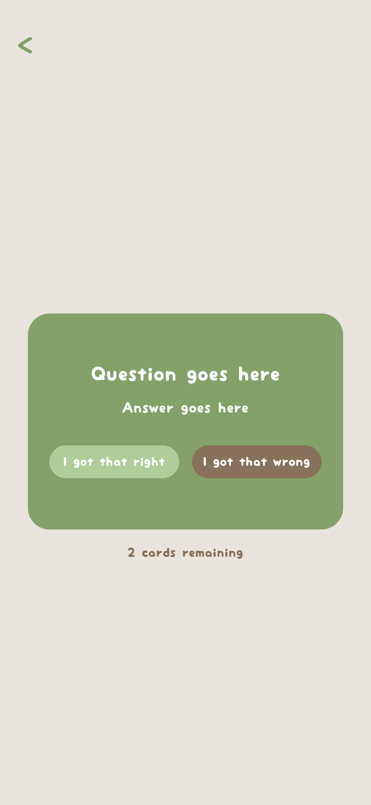
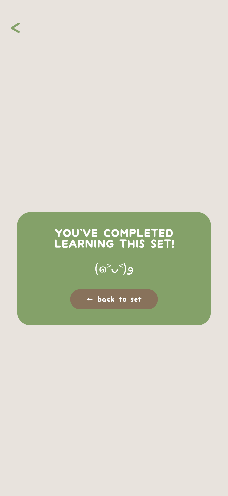

##  To-Do Lists 
### Creating lists & tasks 

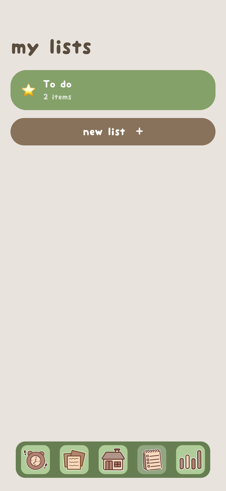
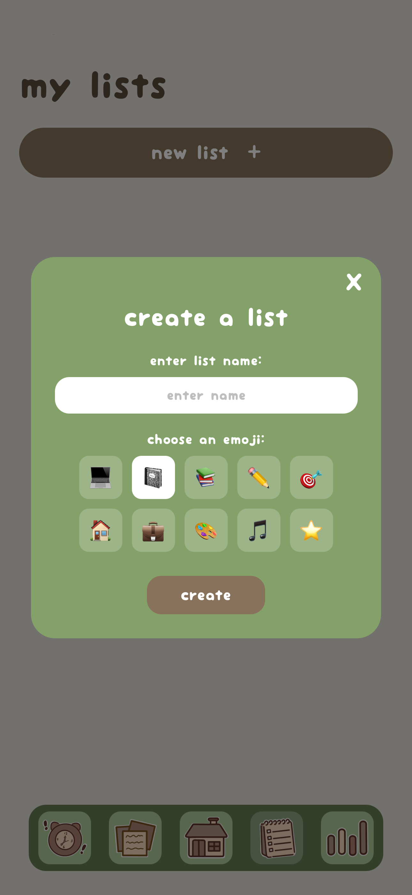
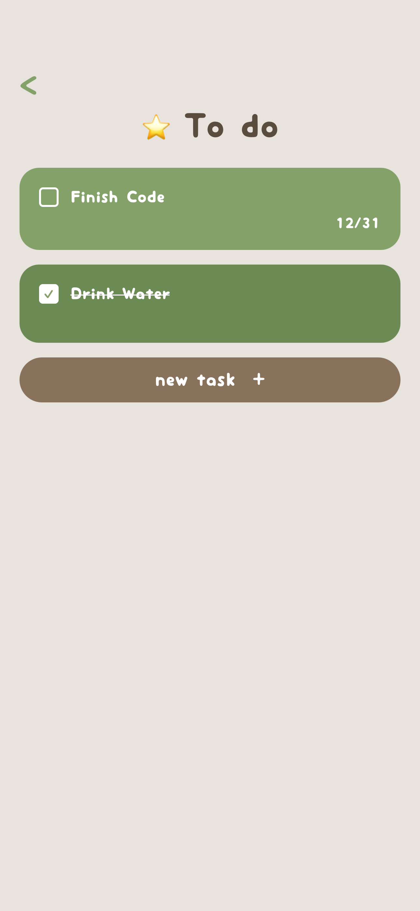
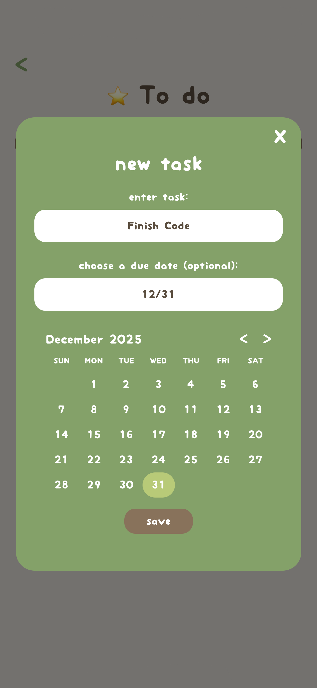

### Homescreen task display

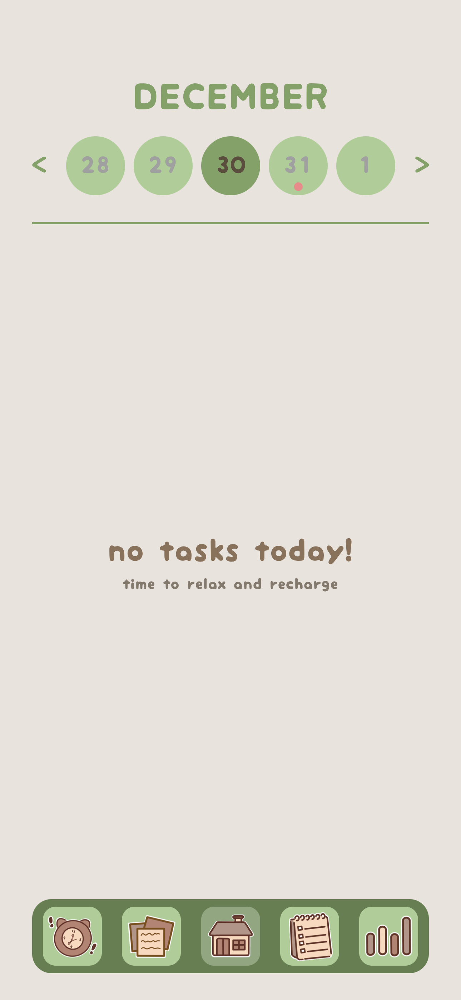
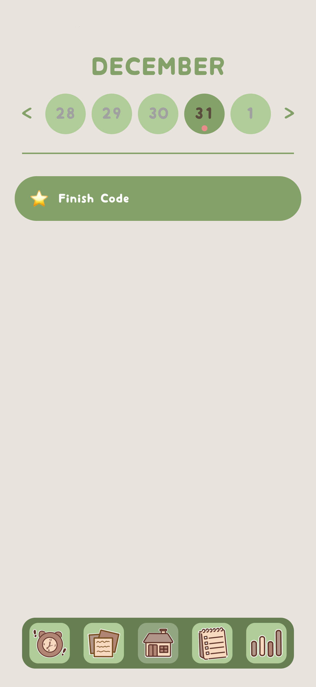

##  Study Timer 
### Default state & Focus

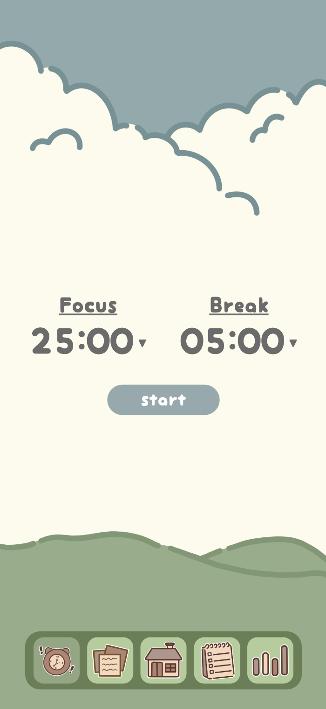
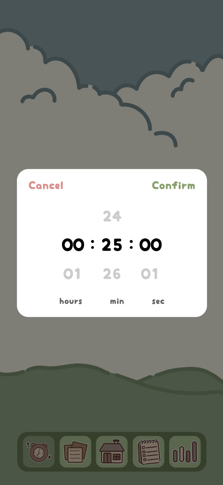
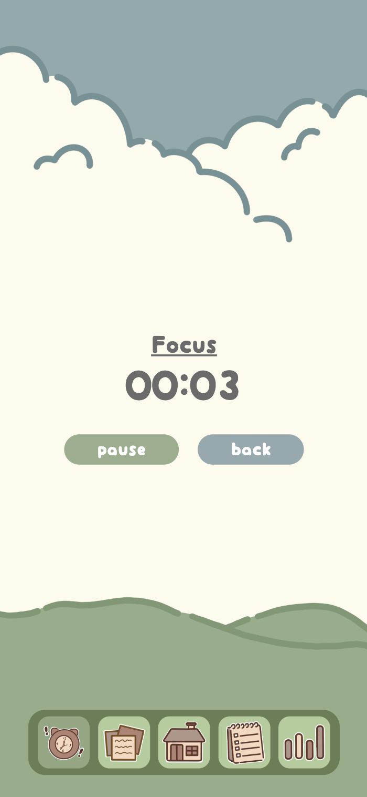

### Break & Draw

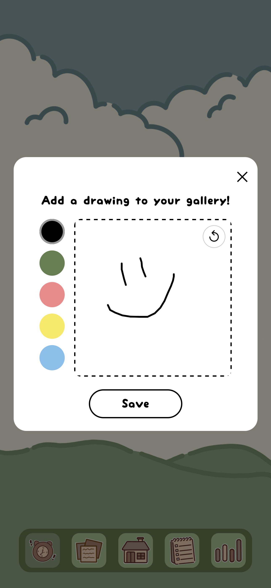
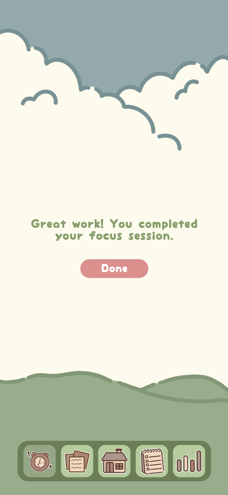

 
##  Statistics, Gallery, & Settings  

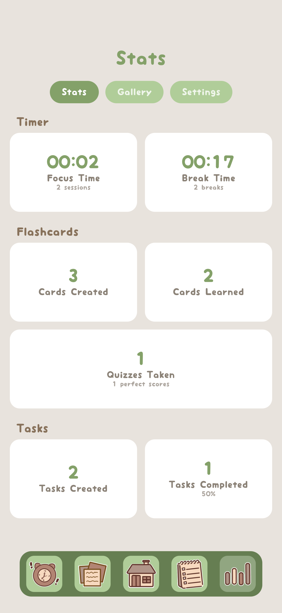
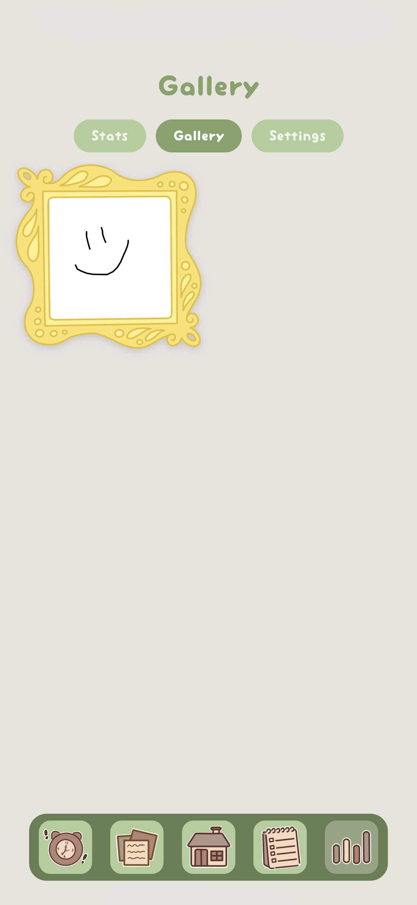
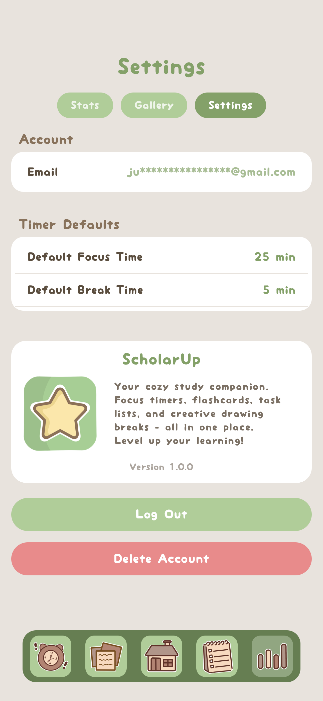

 
 ## App Icon

---

## 🛠 Development & Architecture

### Tech Stack

| Layer | Technology | Purpose |
|-------|------------|---------|
| **Frontend** | React Native 0.81.5 | Cross-platform mobile development |
| **Framework** | Expo 54.0 | Development tooling & builds |
| **Language** | TypeScript 5.9 | Type-safe JavaScript |
| **Backend** | Supabase | Database, Auth, Storage |
| **Navigation** | React Navigation 7 | Screen routing & tabs |
| **State** | React Context | Global state management |

---

## Roadmap & Future Updates

### Version 1.0.0 (Planned)   
- [ ] Timer sound alert
- [ ] Export Data (flashcards, stats)
- [x] Eraser in doodle pop up

### Version 1.2.0 (Planned)
- [ ] Flashcards & Lists search bar
- [ ] Recurring Tasks (daily, weekly, monthly)
- [ ] Spaced repetition algorithm for flashcards (anki method)
- [ ] Import flashcards from Quizlet

### Version 1.3.0 (Planned)
- [ ] Web Version

### Version 2.0.0 (Future)
- [ ] Pomodoro session enhancements (add tasks to your focus session)
- [ ] Push notifications for task reminders
- [ ] Widget support for home screen
- [ ] Study streak tracking
- [ ] Badges (100 flashcards learned, etc.)
- [ ] Color theme picker intead of a green color scheme

## Feature Requests
Have an idea? [Open an issue](https://github.com/jujubeanCS/ScholarUP/issues) with the `enhancement` label!

---

# 📜 Version History

| Version | Date | Highlights |
|---------|------|------------|
| **BETA** | Dec 2025 | Initial public release |
| | | Flashcards with images & quiz mode |
| | | To-do lists with due dates |
| | | Focus timer with doodle breaks |
| | | Statistics dashboard |
| | | User authentication |
| | | Cloud sync with Supabase |

---

**Made with 💚 by Juju**

*ScholarUp - LevelUp Your Learning*

